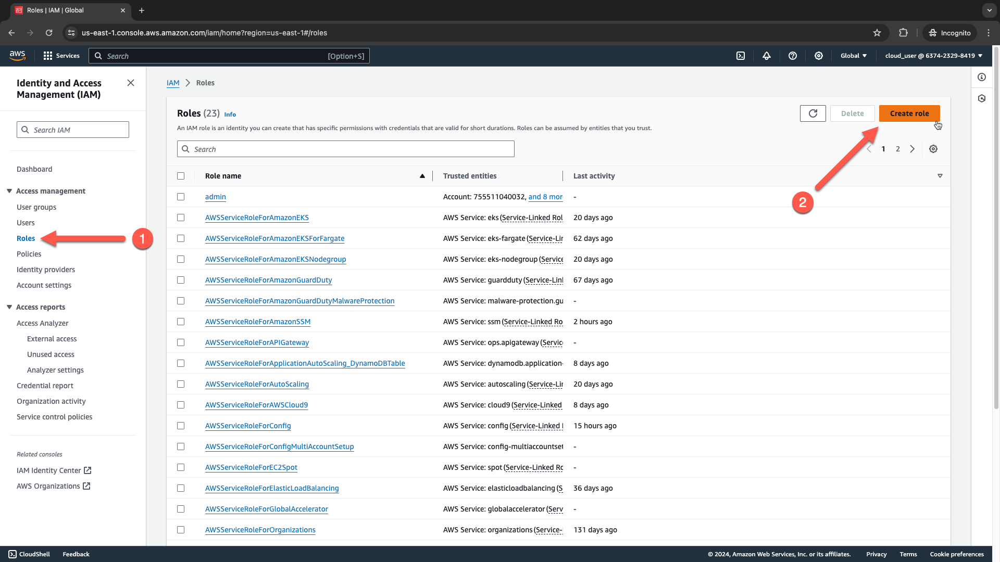
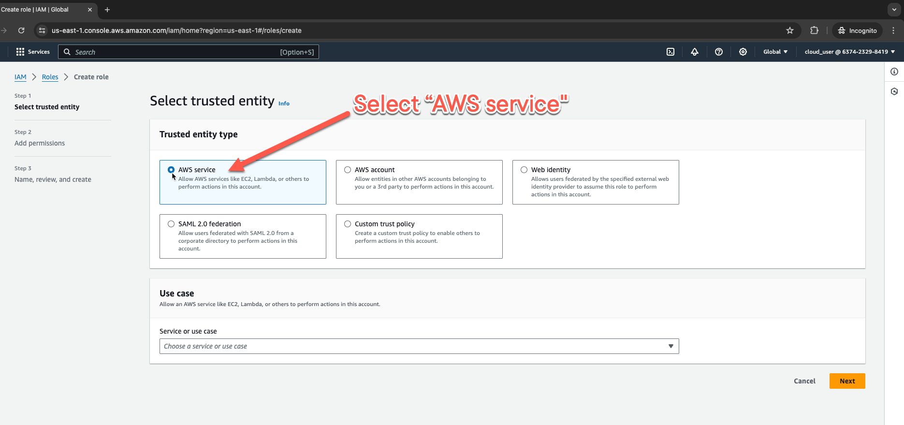
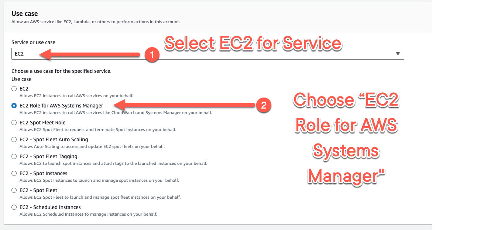
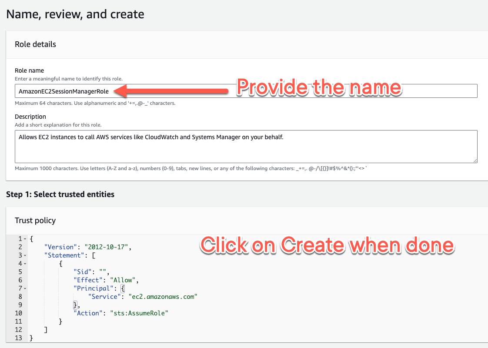
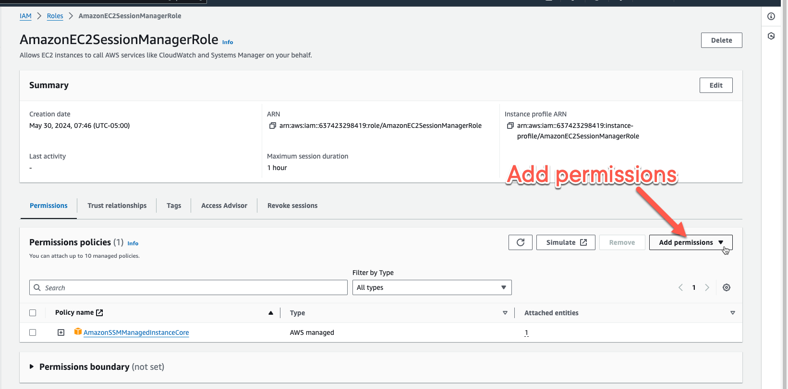
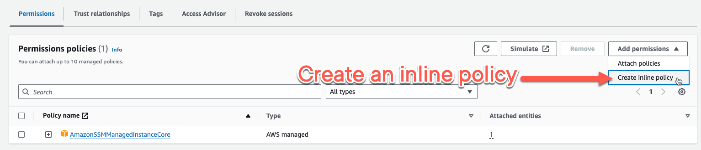
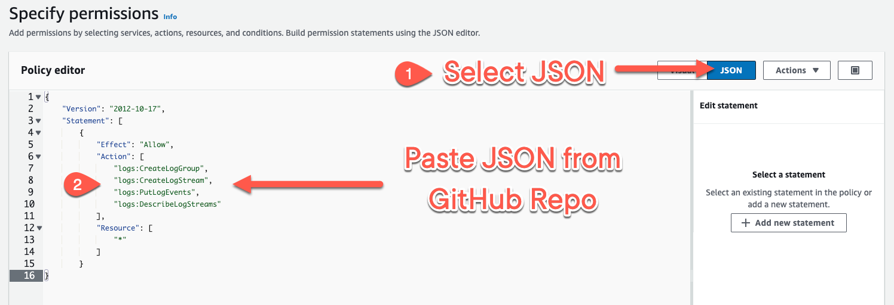
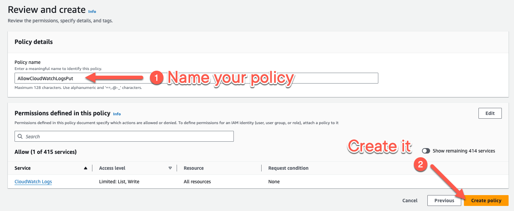

# Installing and Configuring the Amazon CloudWatch Agent (Linux)

To configure the CloudWatch agent on a Linux instance to send custom application log files to CloudWatch, you need to
follow these steps:

1. Create an IAM role with the relevant permissions and attach it to the Linux instance. (_see example policy below_)
2. Install the CloudWatch agent in the instance.
3. Prepare the Configuration File (Manually).
4. Start the CloudWatch agent service in the instance (Manually).
5. Monitor the logs using CloudWatch web console.

## 1a - IAM Inline Policy example

**Role Name**: AmazonEC2SessionManagerRole

> **PLEASE READ**: Below is the inline policy content used in the lesson/clip.
> **You must also attach the `AmazonSSMManagedInstanceCore` AWS-managed policy in addition to this for this to work!**

AmazonSSMManagedInstanceCore Role Arn: `arn:aws:iam::aws:policy/AmazonSSMManagedInstanceCore`

### `AllowCloudWatchLogsPut` Inline Policy:

```json
{
  "Version": "2012-10-17",
  "Statement": [
    {
      "Effect": "Allow",
      "Action": [
        "logs:CreateLogGroup",
        "logs:CreateLogStream",
        "logs:PutLogEvents",
        "logs:DescribeLogStreams"
      ],
      "Resource": [
        "*"
      ]
    }
  ]
}
```

---

## 1b - Creating EC2 Role Walkthrough

Here is a guided walkthrough for creating the IAM Role/Instance Profile used in the course lecture.

1. Navigate to IAM and create a new role



2. Select `AWS service` as the trusted entity type



3. Select `EC2` for the Service and then `EC2 Role for AWS Systems Manager` as the use case



4. Provide your Role name and select `Create` when done



5. Once the Role is created, navigate to it, then select `Add permissions`



6. Select `Create inline policy` from the dropdown menu



7. Select `JSON` on the editor, then paste in
   the [JSON code from the GitHub repo](./iam_policies/AllowCloudWatchLogsPut-Inline.json)



8. Name your inline policy and create on `Create`



**DONE**

---

## 2 - Install CloudWatch Agent

Execute this user data at launch, or you can copy and paste each line as you see fit:

```bash
#!/bin/bash

sudo yum update -y

# Installing the agent
sudo yum install amazon-cloudwatch-agent -y

# Allowing rsyslogs to be collected and saved. This is NOT a default in AML2023
dnf install rsyslog -y
systemctl enable rsyslog --now

# Echo the config file contents into the JSON file.
sudo cat <<EOF >>/opt/aws/amazon-cloudwatch-agent/etc/amazon-cloudwatch-agent.json
{
    "agent": {
        "metrics_collection_interval": 60,
        "run_as_user": "root",
        "region": "us-east-1",
        "debug": true
    },
    "logs": {
        "logs_collected": {
            "files": {
                "collect_list": [
                    {
                        "file_path": "/var/log/messages",
                        "log_group_name": "{instance_id}",
                        "log_stream_name": "messages",
                        "timezone": "UTC"
                    },
                    {
                        "file_path": "/var/log/secure",
                        "log_group_name": "{instance_id}",
                        "log_stream_name": "secure",
                        "timezone": "UTC"
                    }
                ]
            }
        }
    }
}
EOF

# Do not copy this if you want to manually start this agent.
# Fetching local config and starting agent
sudo /opt/aws/amazon-cloudwatch-agent/bin/amazon-cloudwatch-agent-ctl -a fetch-config -m ec2 -s -c file:/opt/aws/amazon-cloudwatch-agent/etc/amazon-cloudwatch-agent.json
```

---

## 3 - Prepare the Configuration File (Manually)

If you want to manually implement the file instead of using the above user data script, then here is a sample JSON you
can use.

**File Location:** /opt/aws/amazon-cloudwatch-agent/etc/amazon-cloudwatch-agent.json

```json
{
  "agent": {
    "metrics_collection_interval": 60,
    "run_as_user": "root",
    "region": "us-east-1",
    "debug": true
  },
  "logs": {
    "logs_collected": {
      "files": {
        "collect_list": [
          {
            "file_path": "/var/log/messages",
            "log_group_name": "{instance_id}",
            "log_stream_name": "messages",
            "timezone": "UTC"
          },
          {
            "file_path": "/var/log/secure",
            "log_group_name": "{instance_id}",
            "log_stream_name": "secure",
            "timezone": "UTC"
          }
        ]
      }
    }
  }
}
```

---

## 4 - Start the CloudWatch agent service in the instance (Manually)

Only needed if you did not run the full user data above.

### Starting and fetching config

```bash
sudo /opt/aws/amazon-cloudwatch-agent/bin/amazon-cloudwatch-agent-ctl -a fetch-config -m ec2 -s -c file:/opt/aws/amazon-cloudwatch-agent/etc/amazon-cloudwatch-agent.json
```

### Starting with existing config already fetched

```bash
sudo /opt/aws/amazon-cloudwatch-agent/bin/amazon-cloudwatch-agent-ctl -a start -m ec2 -s
```

---

## 5 - Monitor the logs using CloudWatch web console.

Your logs should now be pushing to CloudWatch Logs!
