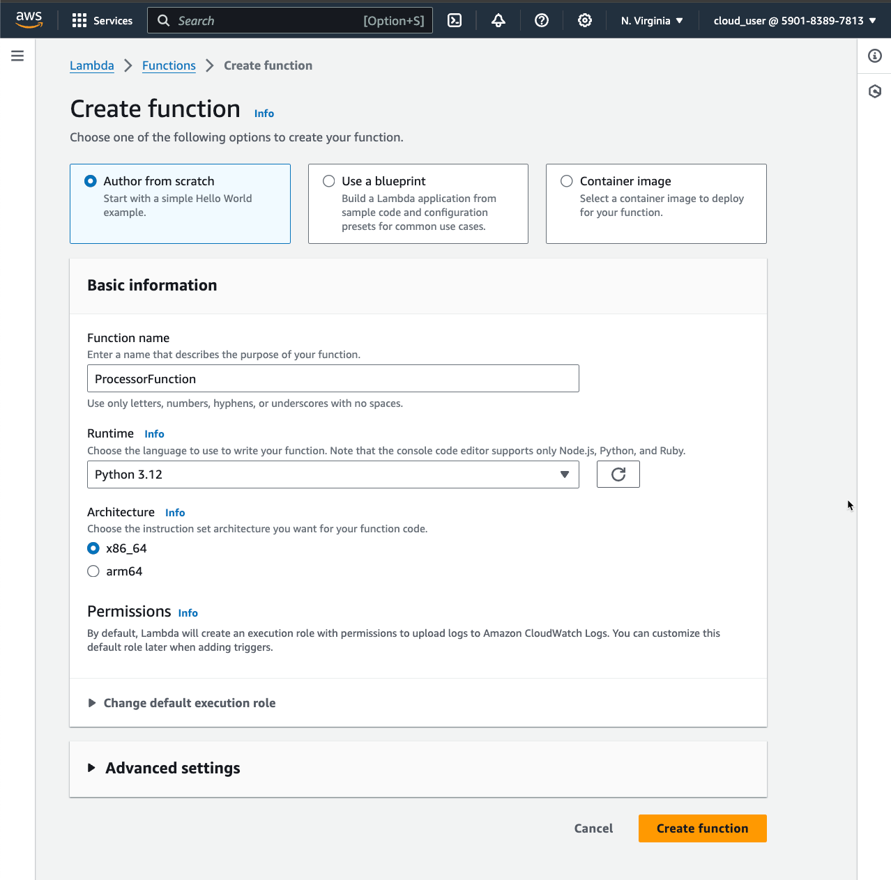
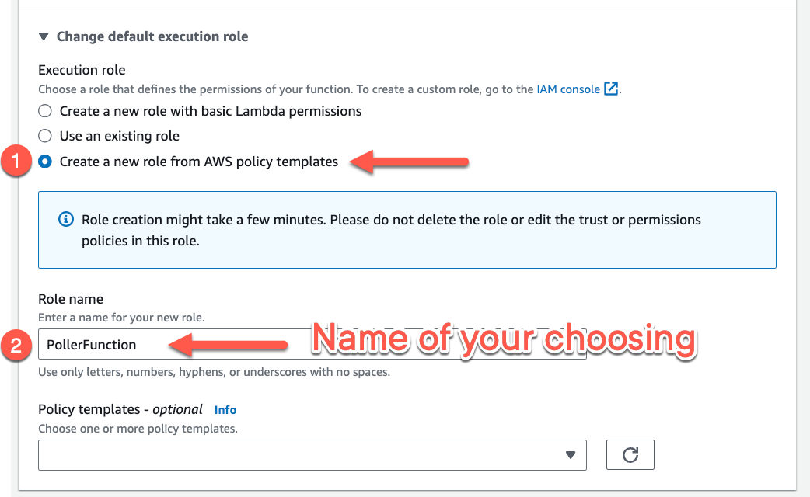
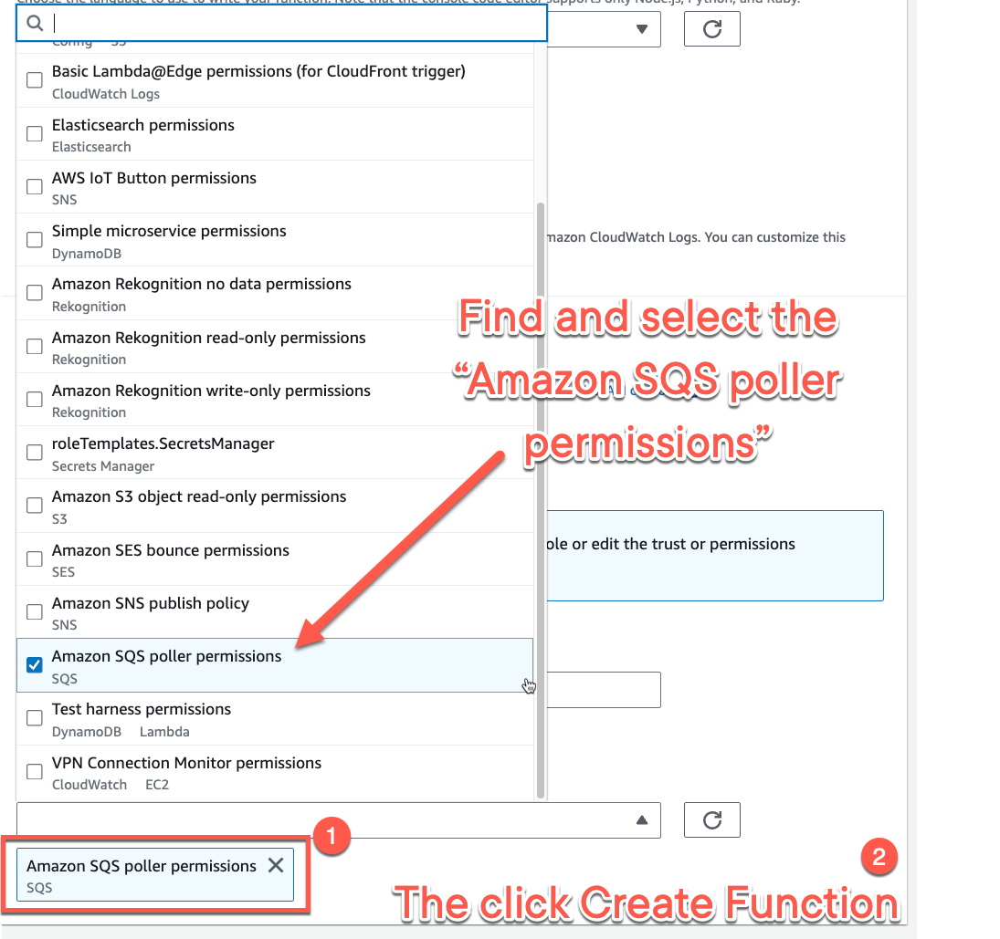
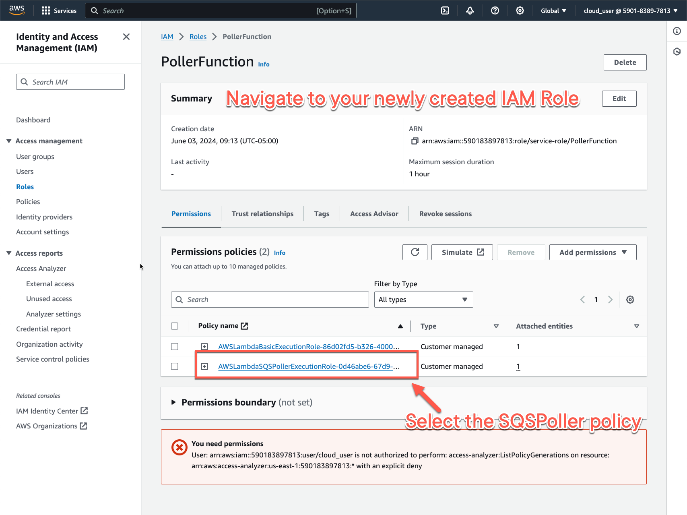
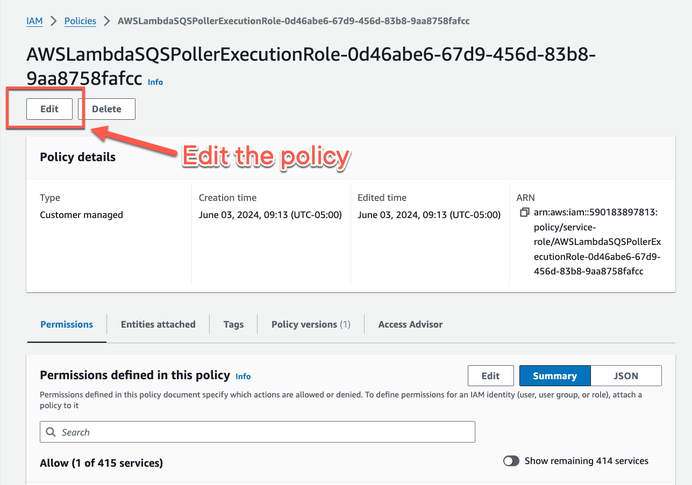
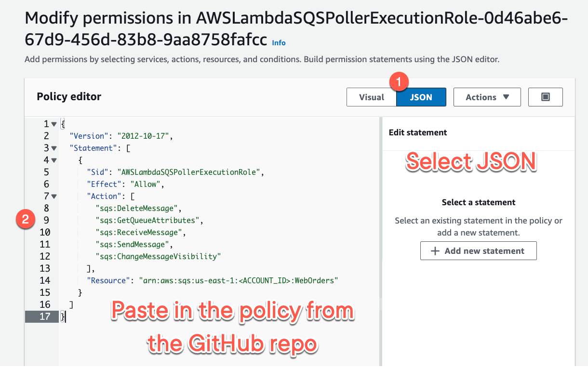
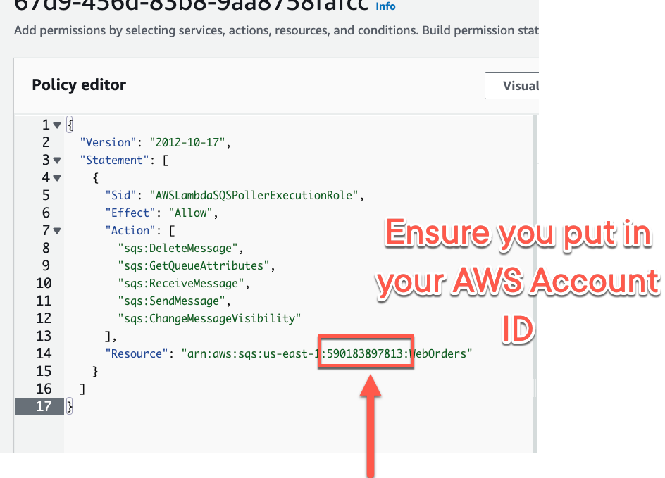

# Sidelining Messages with Dead Letter Queues

Relevant documentation for this lesson.

## Creating the Lambda Function IAM Policy

Let's work on creating the IAM policy for this demo.

1. Navigate to Lambda and create your new function. Select `Author from scratch`

2. Under **Permissions**, select `Create a new role from AWS policy templates`, and then provide a name for your IAM
   Role.

3. Open up the dropdown menu, then find and select `Amazon SQS poller permissions`

4. Navigate to the newly created IAM Role and select it.

6. Find and select the Policy starting with `AWSLambdaSQSPollerExecutionRole-`

6. Once within the Policy page, find and select `Edit`

7. Select the `JSON` format editor, and then paste in
   the [sqs_perm_only_lambda_function_iam_policy.json](./sqs_perm_only_lambda_function_iam_policy.json) contents.
   Overwrite the existing contents.

8. **IMPORTANT**: Change the `<ACCOUNT_ID>` within the policy to match your AWS Account ID number!

9. Click on `Next`, ensure you have `Set this new version as the default` checkbox selected, and then
   click `Save changes`
10. You are done with the IAM role!