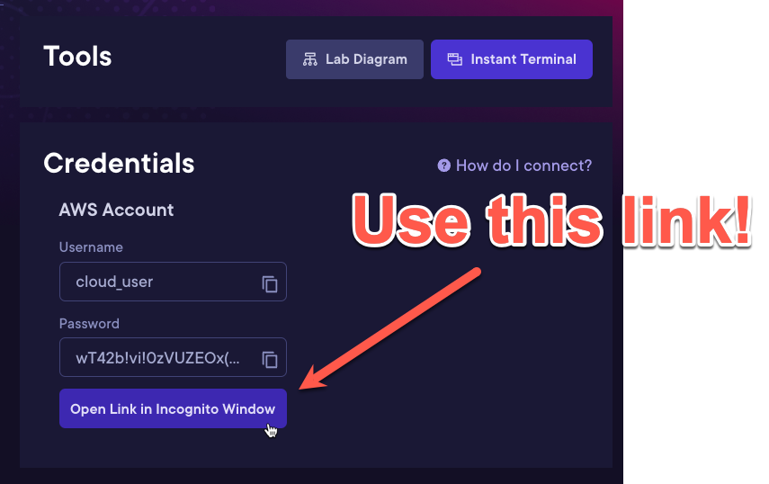

# 1.2 - Creating a CloudTrail Trail and EventBridge Alert for Console Sign-Ins

---

## IMPORTANT NOTE

When testing the alert for the console sign-in, please be sure to leverage the URL provided in the Hands-on Lab launch
screen to log back into the console.

**This might not work properly if you just navigate back through the default AWS console log-in screen!**

> See below for example...

